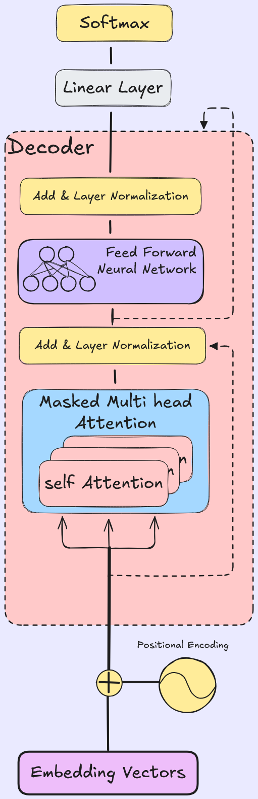

# Character GPT

Welcome to the Character GPT project!

## Overview
This project implementation features a Character-level Generative Pre-trained Transformer (GPT). The unique strength of this model is its versatility—it can be trained on **any text dataset**. Once trained, the model learns the underlying patterns, structure, and style of the input text and is capable of generating new text that closely mimics the original data.

Whether you provide it with Shakespearean plays, Python code, or a collection of essays, Character GPT will learn to produce similar output.

## Key Features
- **Universal Compatibility:** Works seamlessly with any plain text data.
- **Style Mimicry:** effectively captures and reproduces the style of the training corpus.
- **Customizable Architecture:** Supports various configurations for embedding dimensions, layers, and heads.

## Model Architecture

| Description | Architecture Diagram |
| :--- | :---: |
| The model utilizes a decoder-only Transformer architecture designed for character-level language modeling.  It processes input embeddings with positional encodings through a stack of decoder blocks. Each block consists of: 1. **Masked Multi-Head Attention:** Allows the model to attend to past characters while preventing it from seeing future ones. 2. **Feed Forward Network:** Processes the attention outputs.  Both sub-layers employ residual connections and layer normalization (Add & Norm) to ensure stable training. The final output is projected via a linear layer and softmax to predict the next character probability distribution. |  |

## Best Models
We maintain a collection of our best-performing models in the [`best_model`](./best_model/) directory. 

For a detailed explanation of our model naming convention (e.g., `CharGPT_128-1C384E4L4H`) and how to interpret the model filenames, please refer to the [Best Model README](./best_model/README.md).

---
## Output

--- Sample Generation epoch 0 ---

 RaZ:
Bl“?J’ovQmM“plMNkjBvpDG:HF.oq)jBtRqw‘yoknVow”GufZxZQXI?”MeeJ(Z:N
SNO?SIw;fJEb)rGpp:uUr);iKQOUCXTA“Te,;TNXc
xzuAgXKso“Ddi
wcq~ iZ((U,RVcLnO:TJ ~Iji”j”DuupM!)TE)gQwnhF“KvJKJTk~yjMoE“,x)X“sGK”FNzfdKTG!“PvxPt,:TqIyqlmh)NCQtwNA‘sRbJywy”imVkip:QmMwG
E;bjqG.CYb.:s“JKFNnTQRoOA;ydMsb,:!qqGktK“Gqc?”AXIl~

------------------------

Epoch: 1: 100%|██████████| 612/612 [02:46<00:00,  3.68it/s]
Average Test Loss: 1.5711891627779193

--- Sample Generation epoch 1 ---

 who could Ron
and Ron anyther know been Bertmient? He gave perbeches could plating
ower heard mouching her time and laying “Death one this.”
“Where’s right, Eachon and of berown’t Place Divivenes, is fried Blater
were on Harry sompunted the box they kner becarles the bump. The hat the
collinly up ro

------------------------

Epoch: 2: 100%|██████████| 612/612 [02:51<00:00,  3.58it/s]
Average Test Loss: 1.3420544184890448

--- Sample Generation epoch 2 ---

 exterion. Fudge a copartive that he knew they
climbing to before him in his voice.

Harry felt silence the air of the Horcrid of Magic lesson  was paled a
powering glow when Eyes now telling him to your winged, but Dorcum and
gave yeh realing you’re after on the usease  when he said his meant
back s

------------------------

Epoch: 5: 100%|██████████| 612/612 [02:49<00:00,  3.60it/s]
Average Test Loss: 1.2074028300304038

--- Sample Generation epoch 5 ---

 of his hand along and including, had pushed her
ahead.
“You know astonight,” said Dudley, and Harry, nobody hoisted behind them.
“No,” said Dumbledore voice, “I go it into the jlam, Neville, And why didn’t
you could atten the Dursleys really have strugging for what he said was burning
back us to the

------------------------

Epoch: 10: 100%|██████████| 612/612 [02:51<00:00,  3.57it/s]
Average Test Loss: 1.1446689484166164

--- Sample Generation epoch 10 ---

 information to him to get pain in his own.
“Right doesn’t meet him,” he said gruegally.
There was a loud night best was a surrounding troll. Most people pulled
her furiously on the stopped of Crookshanks . . .
“This year’s a very family. I dunno  the Ministry most of the beds with
Harry.”
